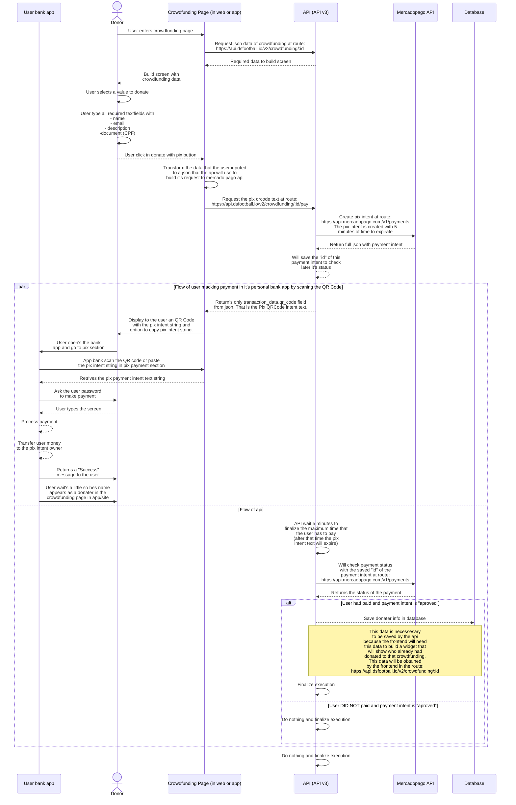

# Systems integration to make pix donation
Quick flowchart documentation about how a pix donation will work and all participants of this operation and there respective function in the flow.

## Coverage of how crowdfunding screen will work.
This is the same flow in the web and mobile. Since this crowdfunding page package will be is in the app as a package dependency and in the web version app as well.

### Useful resources:
[Click here](https://github.com/igormidev/dsfcrowdfunding.github.io/blob/master/docs/json_examples/crowdfunding_data_example.json) to see a example of `https://api.dsfootball.io/v2/crowdfunding/:id`` response.